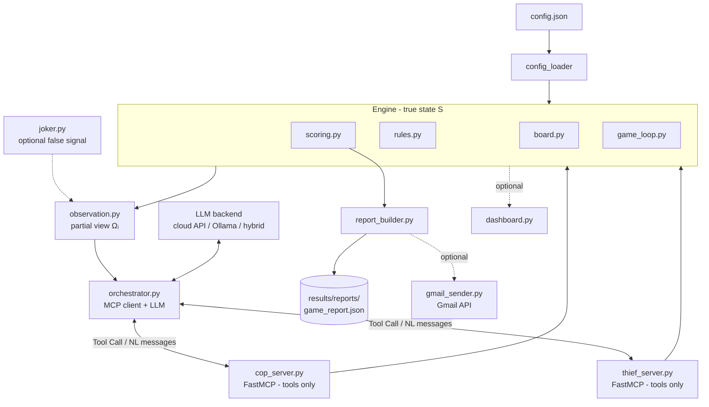

# MCP Chase: Joker Protocol

> **Course:** Orchestration of AI Agents · **Assignment:** EX06 — Dual AI
> Agent Conversation via MCP Servers
> **Current status:** 🟡 **Phase 1 — project skeleton + configuration only.
> No game logic, agents, or MCP behavior implemented yet, and no results
> exist.**

A dual autonomous AI-agent pursuit game. A **Cop** and a **Thief**, each
running behind its **own MCP server**, converse in **free natural language**
and chase each other on a grid under **partial observation**. The point of
the assignment is **orchestration** — wiring up two autonomous agents that
understand each other and act — not winning the game.

---

## Project Overview

- Two agents: **Cop** (captures) and **Thief** (evades).
- Two **independent MCP servers** (FastMCP), one per agent, exposing **tools
  only**.
- One **MCP client / orchestrator** that owns the dialogue loop and the LLM.
- A turn-based chase on a configurable grid (default **5×5**), modeled
  formally as a **Dec-POMDP**.
- A structured **JSON report** at the end, optionally emailed via the Gmail
  API.
- An **optional creative extension**: the **Joker Protocol** (see below),
  which is off by default and never breaks the baseline rules.

---

## Assignment Summary

Two autonomous AI agents must:

1. **Decipher** each other's natural-language messages.
2. **Infer** the opponent's location under partial observation.
3. **Translate** those inferences into grid moves.

A full **game** is **6 sub-games**; each **sub-game** runs up to **25 moves**.
In a full game a group plays 3 sub-games as Cop and 3 as Thief. The graded
value is the working end-to-end orchestration pipeline running autonomously —
not the strategy or the score.

---

## Baseline Requirements (EX06)

| Area | Requirement |
|------|-------------|
| **Agents** | Two autonomous agents: Cop and Thief |
| **MCP** | Two separate FastMCP servers; LLM lives in the **client**, servers expose tools only |
| **Communication** | Free **natural language**, not a rigid numeric protocol |
| **Board** | Configurable grid, default 5×5; movement in all directions incl. diagonals |
| **Sub-game** | Up to 25 moves; turn-based (Thief first, then Cop) |
| **Game** | 6 consecutive sub-games; results accumulate |
| **Win** | Cop wins by landing on the Thief's cell; Thief wins by surviving 25 moves |
| **Barriers** | Cop may place up to 5 barriers/sub-game; Thief cannot |
| **Scoring** | Cop win → Cop 20 / Thief 5 · Thief win → Cop 5 / Thief 10 (max 90, min 30) |
| **Config** | All parameters in `config.json` — **no hard-coding** |
| **Report** | Structured **JSON only**; optional Gmail API delivery |
| **Deployment** | Local (`localhost`) → cloud, with token auth + firewall/tunnel |
| **Code style** | Every Python file under **150 lines** |

The pursuit is formalized as a **Dec-POMDP**:
`⟨ n, S, {Aᵢ}, P, R, {Ωᵢ}, O, γ ⟩` — see `prd.md` §3 for the full mapping.

---

## Joker Protocol (Optional Extension)

Our optional creative extension, **off by default** (`joker_enabled: false`).
With it disabled, the project follows EX06 exactly.

- The **winner of a sub-game** receives **one Joker Card** for the **next
  sub-game**.
- Playing the Joker **injects one plausible false observation signal** into
  the opponent's partial observation for a single turn.
- It is a pure **observation-layer** extension — a one-shot perturbation of
  the Dec-POMDP observation function `O`.

**It must never:** create a second physical Thief · teleport an agent ·
change scoring · replace any baseline rule. True state `S`, transitions `P`,
and rewards `R` are untouched — only the observation `Ωᵢ` is affected.

---

## Architecture



Key separation: the **LLM lives in the client** (`orchestrator.py`); the two
**MCP servers expose tools only** and never run an LLM. The engine holds the
only true state; agents see only their partial observation.

See `plan.md` for the full folder structure and data flow.

---

## Current Folder Structure (Phase 1)

The skeleton and configuration are in place. Implementation modules
(engine, MCP servers, agents, reporting) will be added in later phases per
`plan.md`.

```
AI_Agents_Hw6/
├── README.md                 # this overview
├── prd.md                    # product requirements
├── plan.md                   # architecture + folder/data flow
├── todo.md                   # phased checklist
├── config.json               # ALL parameters (no hard-coding)
├── requirements.txt          # declared dependencies for planned phases
├── .gitignore                # excludes secrets, caches, generated results
├── src/
│   ├── __init__.py
│   └── main.py               # Phase 1 CLI placeholder (no game logic)
├── tests/
│   ├── __init__.py
│   └── test_skeleton.py      # smoke tests for structure + config
└── results/                  # generated outputs (empty — nothing produced)
    ├── logs/                 # per-move dialogue + board snapshots
    ├── reports/              # game_report.json
    └── plots/                # optional visualizations
```

## Planned Run Command

Phase 1 exposes only a placeholder entry point that confirms the skeleton is
ready — it does **not** run the game:

```bash
python -m src.main
```

The full planned CLI (servers, orchestrator, reporting) is listed below.

## Planned CLI Commands

> These commands are **planned**, not yet implemented (Phase 1 skeleton only).

```bash
# Start the two MCP servers (separate localhost ports)
python -m src.mcp.cop_server   --config config.json
python -m src.mcp.thief_server --config config.json

# Run a full game (6 sub-games) via the orchestrator / MCP client
python -m src.client.orchestrator --config config.json

# Run a single sanity-check sub-game on a smaller grid
python -m src.client.orchestrator --config config.json --grid 2x2 --games 1

# Enable the optional Joker Protocol
python -m src.client.orchestrator --config config.json --joker

# Build the JSON report only (from the latest run)
python -m src.reporting.report_builder --out results/reports/game_report.json

# Optionally email the report via the Gmail API
python -m src.reporting.gmail_sender --report results/reports/game_report.json

# Run unit tests
pytest tests/
```

---

## Current Status

**Phase 1 — project skeleton + configuration.** The repository now contains
the folder structure, `config.json` with all assignment parameters,
`requirements.txt`, `.gitignore`, and a placeholder `src/main.py` entry point
(`python -m src.main`) that only reports the skeleton is ready. **No game
logic, agents, or MCP behavior has been implemented, no runs have been made,
and no results exist yet.** No performance numbers or game outcomes are
reported because none have been produced. Core-engine implementation begins at
Phase 2 per `todo.md`.

---

## Repository Documents

| File | Purpose |
|------|---------|
| `prd.md` | Product requirements: goal, rules, Joker Protocol, evaluation, deliverables |
| `plan.md` | Architecture, folder structure, data/execution flow, testing, submission |
| `todo.md` | Phased checklist (documentation → skeleton → engine → … → submission) |
| `README.md` | This overview |
