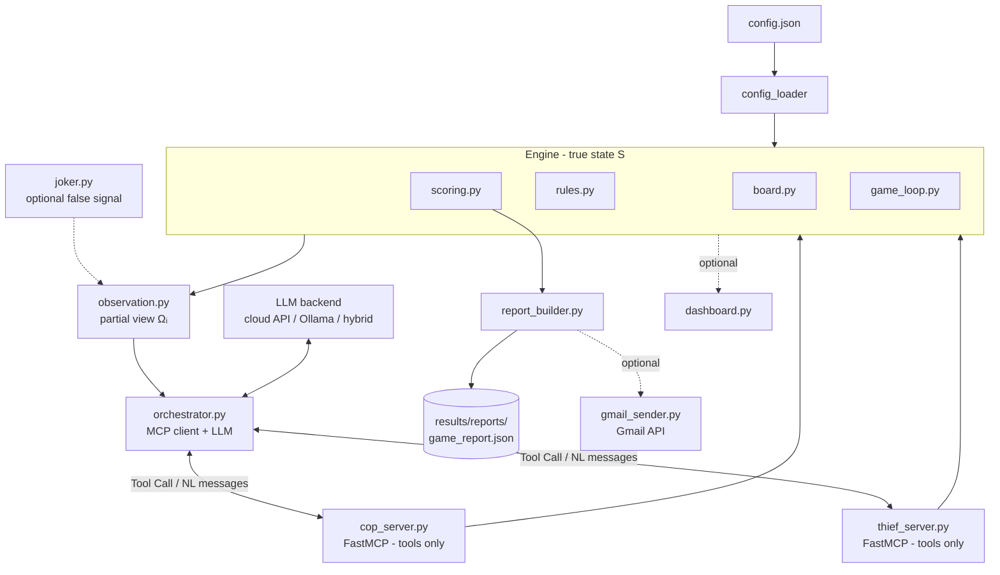

# MCP Chase: Joker Protocol

> **Course:** Orchestration of AI Agents · **Assignment:** EX06 — Dual AI
> Agent Conversation via MCP Servers
> **Current status:** 🟢 **Phase 4 — local tool integration.** The local game
> loop now routes **every** Cop/Thief action through an explicit, **MCP-shaped
> tool call** (`cop.observe_board`, `cop.move`, `thief.use_joker_card`, …) via a
> local tool dispatcher, and logs each call's tool name, input, result, and any
> natural-language message. The FastMCP servers from Phase 3 remain separate and
> are **not** started in a normal run. **Not yet implemented: LLM calls,
> orchestrator over a live MCP transport, GUI, Gmail.**

A dual autonomous AI-agent pursuit game. A **Cop** and a **Thief**, each
running behind its **own MCP server**, converse in **free natural language**
and chase each other on a grid under **partial observation**. The point of
the assignment is **orchestration** — wiring up two autonomous agents that
understand each other and act — not winning the game.

---

## Project Overview

- Two agents: **Cop** (captures) and **Thief** (evades).
- Two **independent MCP servers** (FastMCP), one per agent, exposing **tools
  only**.
- One **MCP client / orchestrator** that owns the dialogue loop and the LLM.
- A turn-based chase on a configurable grid (default **5×5**), modeled
  formally as a **Dec-POMDP**.
- A structured **JSON report** at the end, optionally emailed via the Gmail
  API.
- An **optional creative extension**: the **Joker Protocol** (see below),
  which is off by default and never breaks the baseline rules.

---

## Assignment Summary

Two autonomous AI agents must:

1. **Decipher** each other's natural-language messages.
2. **Infer** the opponent's location under partial observation.
3. **Translate** those inferences into grid moves.

A full **game** is **6 sub-games**; each **sub-game** runs up to **25 moves**.
In a full game a group plays 3 sub-games as Cop and 3 as Thief. The graded
value is the working end-to-end orchestration pipeline running autonomously —
not the strategy or the score.

---

## Baseline Requirements (EX06)

| Area | Requirement |
|------|-------------|
| **Agents** | Two autonomous agents: Cop and Thief |
| **MCP** | Two separate FastMCP servers; LLM lives in the **client**, servers expose tools only |
| **Communication** | Free **natural language**, not a rigid numeric protocol |
| **Board** | Configurable grid, default 5×5; movement in all directions incl. diagonals |
| **Sub-game** | Up to 25 moves; turn-based (Thief first, then Cop) |
| **Game** | 6 consecutive sub-games; results accumulate |
| **Win** | Cop wins by landing on the Thief's cell; Thief wins by surviving 25 moves |
| **Barriers** | Cop may place up to 5 barriers/sub-game; Thief cannot |
| **Scoring** | Cop win → Cop 20 / Thief 5 · Thief win → Cop 5 / Thief 10 (max 90, min 30) |
| **Config** | All parameters in `config.json` — **no hard-coding** |
| **Report** | Structured **JSON only**; optional Gmail API delivery |
| **Deployment** | Local (`localhost`) → cloud, with token auth + firewall/tunnel |
| **Code style** | Every Python file under **150 lines** |

The pursuit is formalized as a **Dec-POMDP**:
`⟨ n, S, {Aᵢ}, P, R, {Ωᵢ}, O, γ ⟩` — see `prd.md` §3 for the full mapping.

---

## Joker Protocol (Optional Extension)

Our optional creative extension, **off by default** (`joker_enabled: false`).
With it disabled, the project follows EX06 exactly.

- The **winner of a sub-game** receives **one Joker Card** for the **next
  sub-game**.
- Playing the Joker **injects one plausible false observation signal** into
  the opponent's partial observation for a single turn.
- It is a pure **observation-layer** extension — a one-shot perturbation of
  the Dec-POMDP observation function `O`.

**It must never:** create a second physical Thief · teleport an agent ·
change scoring · replace any baseline rule. True state `S`, transitions `P`,
and rewards `R` are untouched — only the observation `Ωᵢ` is affected.

In **Phase 2 only the data hooks** exist: card lifecycle (grant to the
sub-game winner) and one-shot false-signal injection into the opponent's
observation, with logging. It is **disabled by default**, so the default run
follows the EX06 baseline exactly. A unit test asserts the injection never
mutates the true state `S`.

---

## Phase 2 — Local Simulation

Phase 2 implements the **core game engine** and a **local, playable
simulation** that runs entirely offline — no network, no LLM, no MCP.

- **Engine (true state `S`)** — `src/engine/`: `board.py` (grid + state),
  `rules.py` (legal moves, capture, barriers), `observation.py` (partial
  view `Ωᵢ`), `scoring.py` (scoring table + totals), `game_loop.py` (sub-game
  + 6-game series driver).
- **Deterministic placeholder policies** — `src/policies/`: a greedy-pursuit
  Cop and a distance-maximizing, centre-seeking Thief. These are **stand-ins
  for the future LLM/MCP agents** so the pipeline can run end-to-end; they are
  not optimized strategy (strategy quality is explicitly *not* graded).
- **Joker data hooks** — `src/joker/joker.py` (disabled by default).
- **Config-driven** — every parameter comes from `config.json`; nothing is
  hard-coded. Phase 2 added `random_seed`, `cop_uses_barriers`,
  `barrier_interval`, `diagonal_movement`, and the output paths.

### Run it

```bash
python -m src.main                       # uses ./config.json
python -m src.main --config config.json  # explicit config
pytest tests/                            # unit tests
```

### Movement rule (per the docs)

The assignment docs (`prd.md` §7.2, and the board row of the baseline table
above) **explicitly allow diagonal movement**. The engine therefore uses
**8-directional (king-move) movement** plus staying in place — *not*
4-directional. This is surfaced in the report as `"diagonal_movement": true`.

### Outputs

- `results/logs/game_log.jsonl` — per-move trace (start state, each agent's
  action + resulting state, any Joker injection, per-sub-game result).
- `results/reports/final_report.json` — structured summary of all 6 sub-games
  plus accumulated totals.

### Observed baseline result (not invented — produced by a real run)

With the baseline `config.json` (5×5 grid, 25 moves, `random_seed: 42`) the
Cop captures the Thief in every sub-game (each in 3–4 moves), giving totals
**Cop = 120, Thief = 30**. This is the expected outcome of *simple* deterministic
policies: in discrete king-move pursuit on a bounded grid, a pursuer that moves
second corners a myopic (one-step-greedy) evader — increasing the grid size does
not help the greedy Thief. The Thief-win branch and its `5 / 10` scoring are
verified through the real game loop by `tests/test_game_loop.py`
(short-horizon sub-game). These placeholder policies will be replaced by
LLM-driven MCP agents in later phases, where deception and inference make the
outcome non-trivial.

> Note: the 30–90 score band in `prd.md` §7.4 describes a **group** that plays
> 3 sub-games as Cop and 3 as Thief. The Phase-2 self-play run instead uses one
> policy as Cop and one as Thief for all 6 sub-games, so its per-side totals are
> not bounded by that band.

---

## Phase 3 — MCP Server Layer

Phase 3 adds two **independent FastMCP servers**, one per agent. Each server
**exposes tools only** and wraps the existing engine through a shared
`GameSession` (`src/mcp/session.py`) — the engine is **not** rewritten. There
is still **no LLM** here: the LLM belongs to the client/orchestrator (Phase 4).

- **`src/mcp/cop_server.py`** — Cop tools: `observe_board`, `receive_message`,
  `send_message`, `move`, `place_barrier`, `get_score`.
- **`src/mcp/thief_server.py`** — Thief tools: `observe_board`,
  `receive_message`, `send_message`, `move`, `use_joker_card`, `get_score`.
- **`src/mcp/session.py`** — FastMCP loader (`require_fastmcp`) + `GameSession`
  wrapping `Board`, `rules`, `observation`, `scoring`, and `Joker`.

`create_server()` **builds but never runs** the server, so tests can import and
construct it without blocking. If FastMCP is missing, `require_fastmcp()` (and
therefore `create_server()`) raises a clear error naming the package to
install (`pip install mcp`, or `pip install fastmcp`). Imports of the modules
themselves succeed regardless — the FastMCP dependency is loaded lazily.

### Run the servers (local only)

```bash
# Cop and Thief MCP servers — separate localhost ports from config.json
python -m src.mcp.cop_server   --config config.json   # localhost:8001
python -m src.mcp.thief_server --config config.json   # localhost:8002
```

> Transport defaults to FastMCP's stdio; the `mcp.cop_server` / `mcp.thief_server`
> host+port in `config.json` are **local `localhost` URLs only** — no cloud URLs
> are configured or faked. Cloud deployment (token auth + firewall/tunnel) is a
> later phase.

### Smoke check (no blocking server started)

```bash
python -c "from src.mcp.cop_server import create_server; \
from src.mcp.thief_server import create_server; print('mcp imports ok')"
pytest tests/test_mcp_servers.py     # tool surfaces + GameSession behavior
```

**State-sync note:** in Phase 3 each server owns its own `GameSession` so its
tools are functional and independently testable. Driving one shared board
across both servers (mutual position validation) is the **orchestrator's** job
in Phase 4.

---

## Phase 4 — Local Tool Integration

Phase 4 wires the **tool-layer abstraction** into the local game flow. The
engine (true state `S`) is unchanged; what changes is the **access path**: the
game loop no longer calls `rules.apply_*` directly — it issues explicit,
**MCP-shaped tool calls** and lets the tool layer touch the engine.

- **`src/tools/local_adapter.py`** — `LocalToolAdapter`: an in-process
  implementation of the agent tools that mirrors the FastMCP servers' surface
  but calls the engine **directly** (no network, no LLM). True state changes
  still happen only in `Board` + `rules`.
- **`src/tools/dispatcher.py`** — `ToolDispatcher`: validates, routes, and
  **logs** every `role.tool` call. It imports the tool names straight from the
  Phase 3 server modules (`COP_TOOLS`, `THIEF_TOOLS`), so local mode and real
  MCP mode share **one** tool vocabulary.
- **`src/tools/messages.py`** — deterministic natural-language message
  templates (still **no LLM**), so `send_message` carries free-text.

Each turn the loop calls, e.g., `thief.observe_board` → `thief.use_joker_card`
(only when enabled) → `thief.send_message` → `thief.move`, then
`cop.observe_board` → `cop.send_message` → `cop.move` / `cop.place_barrier`.

**Local tool adapter vs. real MCP server.** The tool *names* and *shapes* are
identical; only the transport differs:

| | Local tool adapter (this phase) | Real MCP server (Phase 3 modules) |
|---|---|---|
| Where it runs | in-process, same Python call stack | separate FastMCP process, own port |
| Transport | direct function call | MCP (stdio / streamable-http) |
| Started in a normal run? | yes (built per sub-game) | **no** — never started by `python -m src.main` |
| Tool names | `cop.*` / `thief.*` (imported from the servers) | same names, exposed as `@mcp.tool()` |
| LLM | none | none (LLM lives in the client, later phase) |

Every action is written to `results/logs/game_log.jsonl` as a `tool_call`
record containing the **agent role**, **tool name** (`role.tool`), **tool
input**, **tool result**, and the **natural-language message** (or `null`).

### Verify Phase 4

```bash
python -m src.main
python -c "import json; print(json.loads(open('results/reports/final_report.json').read())['totals'])"
python -c "import json; print(next(iter(open('results/logs/game_log.jsonl'))))"
find src -name "*.py" -exec wc -l {} +   # every file < 150 lines
pytest tests/test_tool_layer.py          # tool dispatcher + log + joker + run
```

---

## Architecture



Key separation: the **LLM lives in the client** (`orchestrator.py`); the two
**MCP servers expose tools only** and never run an LLM. The engine holds the
only true state; agents see only their partial observation.

See `plan.md` for the full folder structure and data flow.

---

## Current Folder Structure (Phase 4)

The engine, local simulation, the two MCP servers, and the local tool layer are
implemented. The orchestrator over a live MCP transport, the LLM client, GUI,
and reporting-to-Gmail arrive in later phases per `plan.md`.

```
AI_Agents_Hw6/
├── README.md                 # this overview
├── prd.md · plan.md · todo.md# requirements · architecture · checklist
├── config.json               # ALL parameters (no hard-coding)
├── requirements.txt
├── src/
│   ├── main.py               # Phase 2 CLI: runs the local simulation
│   ├── config_loader.py      # load + validate config.json
│   ├── engine/
│   │   ├── board.py          # grid + true state S
│   │   ├── rules.py          # legal moves (diagonal), capture, barriers
│   │   ├── observation.py    # partial view Ωᵢ (+ Joker injection point)
│   │   ├── scoring.py        # scoring table + accumulated totals
│   │   └── game_loop.py      # sub-game + 6-game series driver
│   ├── policies/
│   │   ├── common.py         # shared legal-move helper
│   │   ├── cop_policy.py     # deterministic greedy pursuit + barriers
│   │   └── thief_policy.py   # deterministic evasion
│   ├── mcp/                  # Phase 3: FastMCP servers (tools only, no LLM)
│   │   ├── session.py        # FastMCP loader + GameSession (wraps engine)
│   │   ├── cop_server.py     # Cop tools over MCP
│   │   └── thief_server.py   # Thief tools over MCP
│   ├── tools/                # Phase 4: local tool layer (mirrors MCP tools)
│   │   ├── local_adapter.py  # in-process tools that call the engine directly
│   │   ├── dispatcher.py     # routes + logs cop.*/thief.* tool calls
│   │   └── messages.py       # deterministic NL message templates (no LLM)
│   ├── joker/joker.py        # Joker data hooks (disabled by default)
│   ├── reporting/report_builder.py  # build final_report.json
│   └── util/logging_util.py  # JSONL trace writer
├── tests/                    # test_rules · test_scoring · test_observation
│   └── ...                   # test_game_loop · test_skeleton · test_mcp_servers
│                             # · test_tool_layer (Phase 4)
└── results/
    ├── logs/game_log.jsonl       # per-move trace (generated)
    ├── reports/final_report.json # series summary (generated)
    └── plots/                    # optional visualizations (later phase)
```

## Run Command

```bash
python -m src.main
```

This runs the full local simulation (6 sub-games) **through the local tool
layer** and writes `results/logs/game_log.jsonl` (one `tool_call` record per
action) and `results/reports/final_report.json`. No MCP server is started.

## MCP Server Commands (Phase 3 — implemented)

```bash
# Start the two MCP servers (separate localhost ports, tools only, no LLM)
python -m src.mcp.cop_server   --config config.json   # localhost:8001
python -m src.mcp.thief_server --config config.json   # localhost:8002
```

## Planned CLI Commands (later phases)

> These commands are **planned**, not yet implemented (there is no
> orchestrator, LLM, GUI, or Gmail yet).

```bash
# Run a full game (6 sub-games) via the orchestrator / MCP client
python -m src.client.orchestrator --config config.json

# Run a single sanity-check sub-game on a smaller grid
python -m src.client.orchestrator --config config.json --grid 2x2 --games 1

# Enable the optional Joker Protocol
python -m src.client.orchestrator --config config.json --joker

# Build the JSON report only (from the latest run)
python -m src.reporting.report_builder --out results/reports/game_report.json

# Optionally email the report via the Gmail API
python -m src.reporting.gmail_sender --report results/reports/game_report.json

# Run unit tests
pytest tests/
```

---

## Current Status

**Phase 4 — local tool integration.** On top of the Phase 3 servers, the local
game loop now routes **every** Cop/Thief action through an explicit,
MCP-shaped tool call via `src/tools/dispatcher.py` (`ToolDispatcher`) against
`src/tools/local_adapter.py` (`LocalToolAdapter`). The dispatcher imports the
tool names from the Phase 3 server modules, so local and MCP modes share one
vocabulary (`cop.observe_board`, `cop.move`, `cop.place_barrier`,
`thief.observe_board`, `thief.move`, `thief.use_joker_card`, …). Each call is
logged as a `tool_call` record with the **agent role**, **tool name**, **tool
input**, **tool result**, and any **natural-language message**. The engine is
**not** rewritten — the tool layer is the access path, not a second copy of the
state; scoring and the sub-game winner stay in the loop. The FastMCP servers
stay separate and are **never started** by `python -m src.main`. `pytest
tests/` (34 tests, 1 skipped when FastMCP is absent) now also covers the tool
dispatcher, log tool-name coverage, the Joker tool's observation-only effect,
and that a normal run still writes the report and logs. Every Python file stays
under 150 lines.

**Current limitations:** **no LLM calls yet, no orchestrator over a live MCP
transport yet, no GUI yet, and no Gmail sending yet.** The natural-language
messages are deterministic templates, not model output. MCP host/port settings
are **local `localhost` URLs only** — no cloud URLs are configured or faked.
Reported outcomes come only from real runs (see *Observed baseline result*
above); nothing is invented.

---

## Repository Documents

| File | Purpose |
|------|---------|
| `prd.md` | Product requirements: goal, rules, Joker Protocol, evaluation, deliverables |
| `plan.md` | Architecture, folder structure, data/execution flow, testing, submission |
| `todo.md` | Phased checklist (documentation → skeleton → engine → … → submission) |
| `README.md` | This overview |
